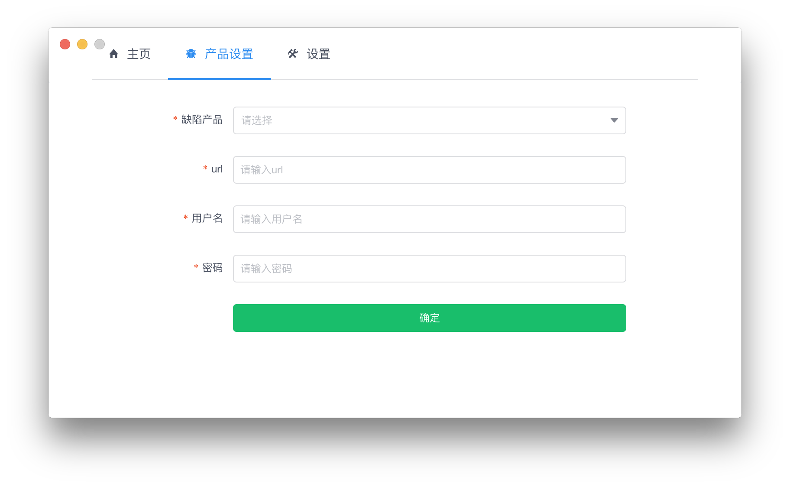
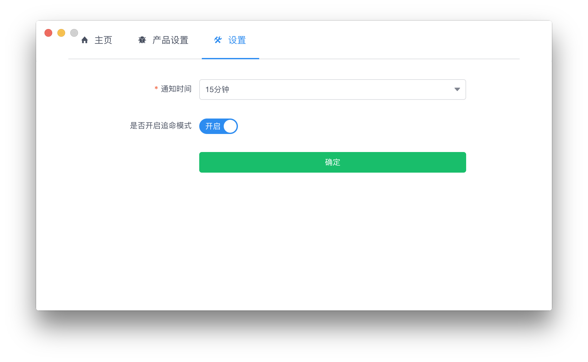

# bug-notify

> 缺陷管理通知，现只支持禅道

## 运行环境
windows8及以上，macOs10.12.6及以上

## 如何使用
``` bash
git clone https://github.com/tookbra/bug-notify.git
cd bug-notify
npm install && npm run dev
```

## 打包应用
``` bash
cd bug-notify
electron-builder --platform=all
```
## 应用截图

